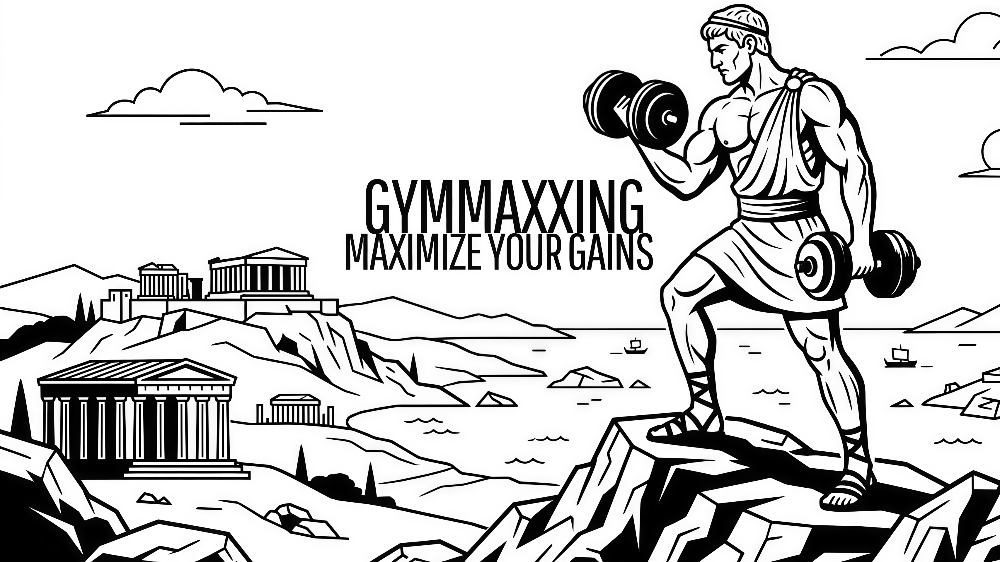

# GymMaxxing

<p align="center">
  
</p>


## Project Description

GymMaxxing is a web platform for managing a gym. Members browse the class schedule, enroll in classes, check equipment availability and review the classes they attended. Trainers manage their profile and class rosters, and admins manage members, trainers, classes and equipment. It also has a membership tier system (Citizen, Olympian and Zeus) with different enrollment limits.

This was a team project (myself, Pedro Gouveia and Victor Gomez) for the Linguagens e Tecnologias Web (LTW) course unit, FEUP, 2025/26.

The full delivered README (feature checklist and test accounts) is kept intact in [`Delivered_Readme.md`](./Delivered_Readme.md).

> This repository is a personal copy (with full commit history preserved) of the original group submission on the course's GitHub organization.

## My Contribution

[Revê e ajusta — tirado dos teus commits:]
- Homepage, header and footer, responsive for different screen widths;
- Page mockups and the CSS structure (`base.css`, `components.css`, `specific.css`);
- Database schema, models and documentation;
- Authentication, form handlers and session utilities;
- AJAX endpoints and client-side scripts, including the class time filter;
- Restructuring the project from static HTML into PHP pages and templates.

## Tech Stack

- **Backend:** PHP with PDO
- **Database:** SQLite
- **Frontend:** HTML, CSS and vanilla JavaScript (AJAX)

## Running

```sh
php -S localhost:9000
```

The database is created and seeded automatically on first access.
